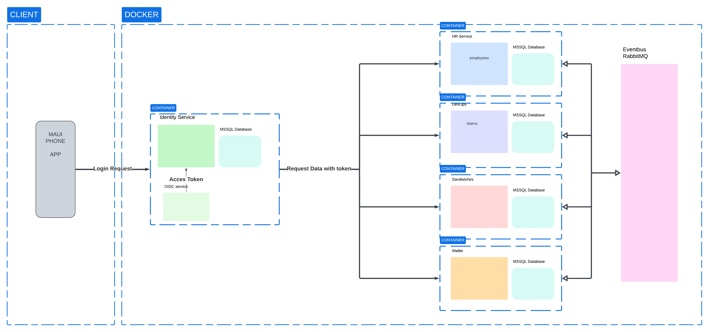

# Architecture
Het architectuur maakt gebruik van microservices die in een containeromgeving gerunt worden.  
Veilige authenticatie, dataverwerking en communicatie tussen de verschillende services worden afgehandeld door RabbitMQ.
## Clients
Een .NET MAUI app wordt gemaakt voor de front-end. 
De app werkt met MVVM en geeft opgevraagde data uit de backend weer.
Een authenticatietoken wordt vanuit de Identityservice meegegeven en de app houdt deze bij om zich te identificeren bij de andere services.
## Docker Omgeving
De services draaien elks in hun eigen container. 
Elke service heeft zijn eigen database die wordt behandeld door een mssql database server die in zijn eigen container draaid.
### Identity Service
Behandeld authenticatie via OIDC die de login token meegeeft.
### HR
Behandeld gebruikers (Employees) en slaat verwante data op in zijn database.
### Devops
Behandeld de samenstelling van teams
### Sandwiches
Stokeerd informatie over sandwiches en hun prijzen
### Wallet
Behandled financiele transacties van de eigenaar
### Event Bus
RabbitMQ wordt gebruikt om communicatie tussen de services te verwerken.  
Services kunnen gebruik maken van evenementen waardoor ontkoppelde en asunchrone communicatie vlot verloopt.
## Doelstelling
De architectuur is ontworpen met een focus op modulariteit, beveiliging en schaalbaarheid:
**Modulariteit** : Elke service is op zichzelf staand en gericht op een specifiek bedrijfsdomein.  
**Beveiliging** : De Identity Service zorgt voor veilige authenticatie en autorisatie met behulp van OIDC en toegangstokens.  
**Schaalbaarheid** : Containerisatie met Docker en het gebruik van RabbitMQ voor gebeurtenisgestuurde communicatie zorgen ervoor dat het systeem efficiënt kan schalen.  
Deze aanpak zorgt ervoor dat het systeem robuust, onderhoudbaar en aanpasbaar is in geval van toekomstige wijzigingen of verbeteringen.  

